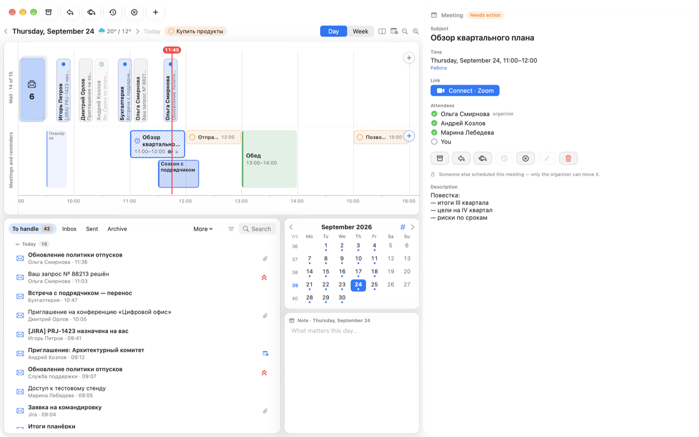
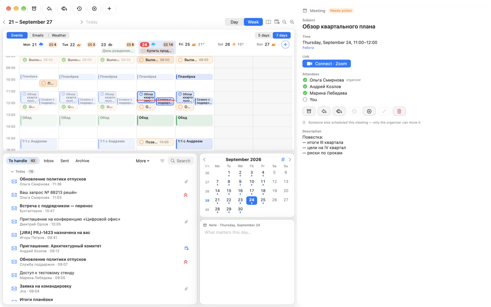
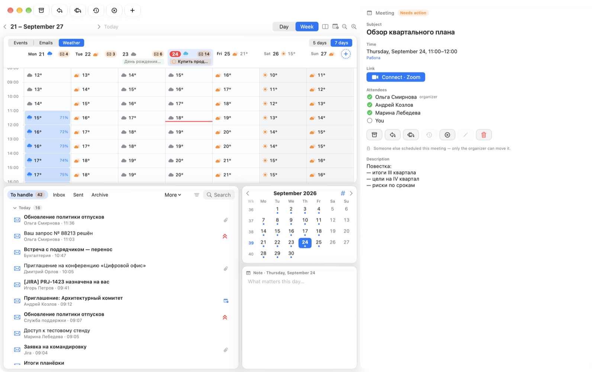

# Trudaybook

[Русский](README.md) · **English** · [简体中文](README.zh.md)

Mail and calendar on one day timeline. Emails sit where they arrived,
meetings where they start, and everything you haven't handled piles up
in one list until you clear it.



**Everything stays on your Mac.** Mail comes straight from your mail
servers, passwords live in the macOS Keychain, and the app has no server
of its own. What goes out and where is listed [in its own section](#what-leaves-your-mac).

---

## Contents

- [How the day works](#how-the-day-works)
- [Week](#week)
- [Features](#features)
- [Keyboard shortcuts](#keyboard-shortcuts)
- [What leaves your Mac](#what-leaves-your-mac)
- [Install](#install) · [Requirements](#requirements) ·
  [Limitations](#limitations) · [Development](#development)

---

## How the day works

An hour scale runs across the top. The upper lane holds emails, placed by
arrival time; close ones stack into a “+N” bundle. The lower lane holds
meetings as blocks as long as they last, and reminders with a “done” circle.

Drag anything onto **Archive**, **Reply** or **Snooze** — or straight onto
the timeline, to a new time. Handled items fade and get a checkmark.
Everything unhandled from all days waits at the bottom in **To handle**:
Inbox Zero. A snoozed email leaves that list and comes back at the hour
you chose.

On the right: the whole email or meeting — replies with formatting,
attachments, invitations with Accept and Decline, attendees and the online
meeting link.

The timeline can run top to bottom too — the button next to “Day | Week”.

## Week



Days as columns, hours top to bottom. Above the calendar you choose what
it shows:

| Mode | On the calendar |
|---|---|
| **Events** | Meetings and reminders |
| **Emails** | Each day's emails by time |
| **Weather** | Hourly weather, blue for the chance of rain |

Next to it — **“5 days | 7 days”**. Each day's header shows the weather and
the count of unhandled emails. Meetings you haven't answered, or answered
“tentative”, are hatched and outlined with a dashed line.



---

## Features

**Mail**
- iCloud, Gmail, Yandex, Mail.ru and any IMAP/SMTP server; corporate
  Exchange directly over EWS (NTLM sign-in). Several mailboxes at once.
- Mailbox folders; search by subject, people and full text on the server.
- Replies and new emails with formatting, quotes and attachments; recipients
  as chips with address book suggestions; a signature per mailbox.
- Priorities (yours and the sender's); swipe actions on list rows — which
  ones is up to you in Settings.
- Meeting invitations: a card with that day's calendar and answer buttons.
- Drag a whole email out as an `.eml` file to Finder.

**Calendar**
- macOS calendars (iCloud, Google, Exchange via Internet Accounts) and
  Exchange directly.
- New meeting: drag “+” to the right time or press and hold on an empty
  spot. An editor with repeat, attendees, location and a free/busy planner.
- macOS reminders on the timeline, checked off with one click.
- A note for every day under the month calendar.

**Notifications** — for new emails in macOS Notification Center; “Reply”
right in the notification sends the answer without opening the window.

**Look** — Liquid Glass on macOS 26, light and dark, calm gradients and
texture backgrounds, your own picture as a background. Russian, English
and Chinese interface.

**Together with [Trunook](https://github.com/TruDevLab/Trunook)** — a MacBook
notch app by the same author (optional, all off by default):
- emails, invitations, upcoming meetings and snoozed emails coming back —
  as banners in the notch, with answer buttons;
- a Mail tile and emails on Trunook's day timeline;
- while a Trunook timer runs, Trudaybook stays quiet and then sends one
  summary notification;
- the Trunook assistant reads unhandled mail, snoozes emails, sets priority
  and labels and drafts replies — **you send them yourself**;
- above each email there's a collapsed “Summary” bar: expand it and Trunook's
  model summarizes the email; “To handle” gets labels — Important,
  Conversation, Notifications, Newsletters — with a filter. Newsletters and
  notifications show up even without Trunook, from the email's headers;
- a shared day note;
- weather in the calendar comes from Trunook.

---

## Keyboard shortcuts

| Keys | Action |
|---|---|
| ⌘E | Archive |
| ⌘R / ⇧⌘R | Reply / reply all |
| ⌘S | Snooze or reschedule |
| ⌘D | Decline a meeting |
| ⌘1 ⌘2 ⌘3 / ⌘0 | High, medium, low priority / clear |
| ⌘T | Today |
| ⌘[ / ⌘] | Previous / next day (week in week view) |
| ⌘= / ⌘− | Zoom in / out |
| ⌥⌘1 / ⌥⌘2 | Day / week |
| ⌥⌘L | Timeline top to bottom |
| ↑ ↓ | Neighbouring item |

---

## What leaves your Mac

- **Your mail servers** — only the ones you add: IMAP and SMTP (ports 993,
  465/587) or Exchange EWS (HTTPS).
- **Update check** — once a day, a request to `api.github.com` for the latest
  version, with the app's name and version in the header; a new version is
  downloaded from GitHub. Turn it off in Settings → Updates. The app connects
  nowhere else on its own: no analytics, no server of its own.
- **Remote images in emails** don't load until you click “Load” above the email —
  otherwise the sender would learn you opened the email. JavaScript in emails
  is always off.
- **Passwords** — in the macOS Keychain, never written to the log.
- **Weather** isn't requested by the app: Trunook sends it, if installed.
- **Summaries and labels** come only from a model on this Mac: if Trunook uses
  a cloud model, it refuses, and the email text goes nowhere.
- Trudaybook talks to Trunook only through files in `~/Library/Application Support`
  on the same Mac.

---

## Install

> **The app is signed with a self-made certificate:** the project has no paid
> Apple developer account. On someone else's Mac, Gatekeeper won't let it
> through by default. The reliable way is to build from source — a build
> signed with your own certificate raises no questions. If you install from
> the disk image, remove the quarantine afterwards with the command below.

**From source**

```bash
git clone https://github.com/TruDevLab/Trudaybook.git
cd Trudaybook
make cert      # your own signing certificate, once
make install   # build and put into Applications
```

**From the disk image** — download `Trudaybook-<version>.dmg` from the release
page, drag Trudaybook to Applications and remove the quarantine:

```bash
sudo xattr -r -c /Applications/Trudaybook.app
```

The image carries the same instructions in “Как установить.txt”. To check
the signature: `codesign --verify --deep --strict /Applications/Trudaybook.app`.

**Updates** arrive by themselves: once a day Trudaybook asks GitHub, downloads
a new version in the background and checks its signature — only a build
signed with the same certificate is installed. An “Update to …” button
appears in the window: click it and the app restarts as the new version,
with calendar and password access still granted. A build you signed with
your own certificate can't update this way — use `git pull` and `make install`.

With no mailbox connected, Trudaybook opens with sample emails and meetings,
so you can see how it works. Add mail in Settings → Mail.

---

## Requirements

- macOS 15 or later; Liquid Glass on macOS 26.
- The disk image is built for Apple silicon Macs. On an Intel Mac, build from
  source — the build targets your processor.
- To build: Command Line Tools with Swift 6 (`xcode-select --install`).
  Xcode isn't needed.
- For iCloud, Gmail, Yandex and Mail.ru — an app password, not your main
  account password.

## Limitations

- Not notarized — see the note above.
- Gmail and Microsoft 365 with OAuth sign-in aren't supported: only an app
  password (Gmail) or your own Exchange server with EWS.
- Someone else's meeting can't be moved — only the organizer can.
- You can't answer the organizer for a meeting from a macOS calendar:
  EventKit can't do that. Answer from the invitation email or in an Exchange
  calendar connected directly.

## Development

Architecture, build, tests and translation — see [DEVELOPMENT.md](DEVELOPMENT.md)
(in Russian).

Found a bug? [Open an issue](../../issues/new/choose) and attach
`~/Library/Logs/Trudaybook.log` with the addresses removed.

License — [MIT](LICENSE).
