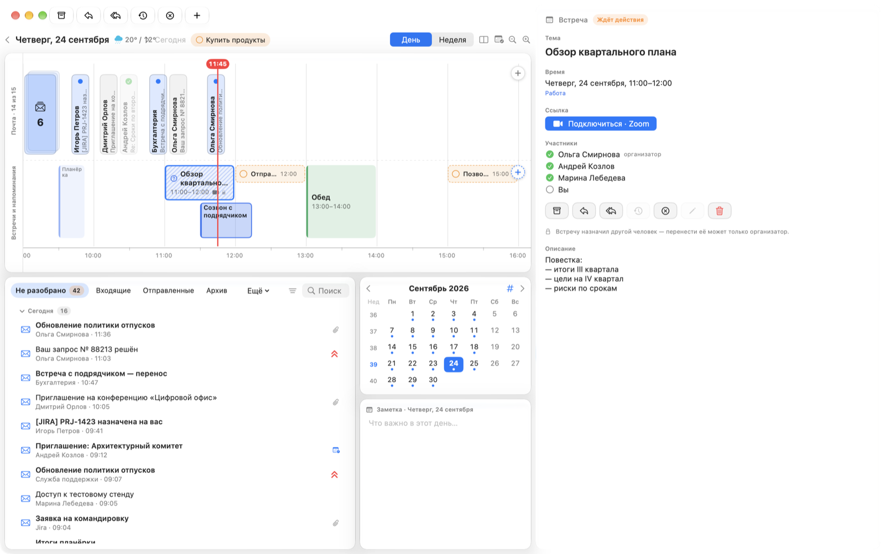
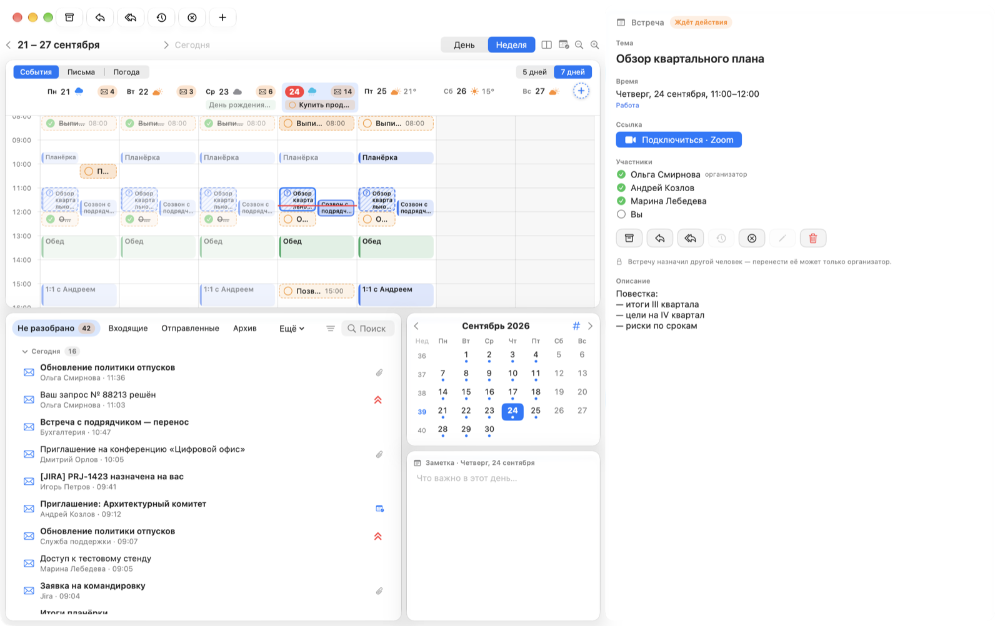
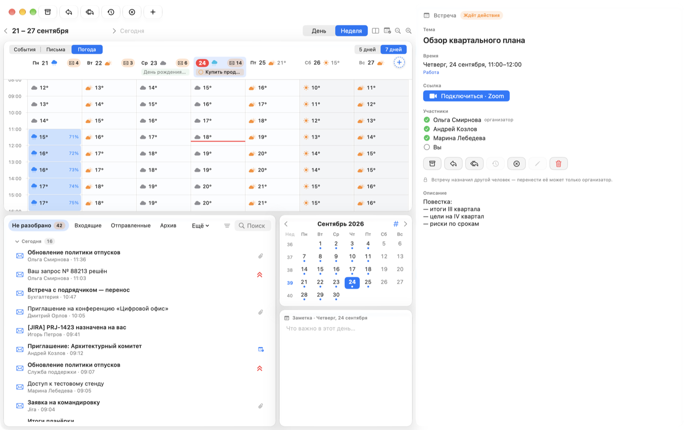

# Trudaybook

**Русский** · [English](README.en.md) · [简体中文](README.zh.md)

Почта и календарь на одной шкале дня. Письма стоят там, когда пришли,
встречи — там, когда начнутся, а всё неразобранное копится в одном списке,
пока вы его не разберёте.



**Всё хранится на вашем Mac.** Письма приходят прямо с ваших почтовых
серверов, пароли лежат в Связке ключей macOS, а своего сервера у приложения
нет. Что и куда уходит — [отдельным разделом](#что-уходит-наружу).

---

## Оглавление

- [Как устроен день](#как-устроен-день)
- [Неделя](#неделя)
- [Возможности](#возможности)
- [Сочетания клавиш](#сочетания-клавиш)
- [Что уходит наружу](#что-уходит-наружу)
- [Установка](#установка) · [Требования](#требования) ·
  [Ограничения](#ограничения) · [Разработка](#разработка)

---

## Как устроен день

Сверху — шкала часов. На верхней дорожке письма: по времени получения,
близкие собираются в пачку «+N». На нижней — встречи блоками по длительности
и напоминания с кружком «выполнено».

Любой элемент перетаскивается на кнопки **«В архив»**, **«Ответить»**,
**«Отложить»** — или прямо на шкалу, на новое время. Разобранное гаснет
и получает галочку. Всё, что не разобрано за все дни, лежит внизу, в списке
**«Не разобрано»**: принцип Inbox Zero. Отложенное письмо пропадает оттуда
и возвращается в выбранный час.

Справа — письмо или встреча целиком: ответ с оформлением, вложения,
приглашения с «Принять» и «Отклонить», участники и ссылка на онлайн-встречу.

Шкалу можно поставить и сверху вниз — кнопкой рядом с «День | Неделя».

## Неделя



Дни колонками, часы сверху вниз. Над календарём — что на нём показывать:

| Режим | Что на календаре |
|---|---|
| **События** | Встречи и напоминания |
| **Письма** | Письма каждого дня по времени |
| **Погода** | Погода по часам, синевой — вероятность осадков |

Рядом — **«5 дней | 7 дней»**. У каждого дня в шапке погода и счётчик
неразобранных писем. Встречи, на которые вы ещё не ответили или ответили
«под вопросом», заштрихованы и обведены пунктиром.



---

## Возможности

**Почта**
- iCloud, Gmail, Яндекс, Mail.ru и любой сервер IMAP/SMTP; корпоративный
  Exchange напрямую через EWS (вход NTLM). Несколько ящиков сразу.
- Папки ящика, поиск по теме, людям и тексту на сервере.
- Ответ и новое письмо с оформлением, цитатой и вложениями; получатели
  плашками с подсказками из адресной книги; подписи для каждого ящика.
- Приоритеты (свои и от отправителя), быстрые действия свайпом по строке
  списка — какие, выбирается в настройках.
- Приглашения на встречи: карточка с календарём этого дня и кнопки ответа.
- Письмо целиком тащится файлом `.eml` в Finder.

**Календарь**
- Календари macOS (iCloud, Google, Exchange через «Учётные записи интернета»)
  и календарь Exchange напрямую.
- Новая встреча: перетащите «+» на нужное время или зажмите мышь на пустом
  месте шкалы. Редактор с повтором, участниками, местом и планировщиком
  занятости.
- Напоминания macOS на шкале — отмечаются выполненными одним щелчком.
- Заметка на каждый день под календарём месяца, а в отдельном окне (⌘J) —
  с оформлением, списками и делами с галочками; заметки недели и месяца.

**Уведомления** — о новых письмах в Центре уведомлений macOS; «Ответить»
прямо в уведомлении отправляет ответ, не открывая окна.

**Оформление** — Liquid Glass на macOS 26, светлая и тёмная тема, спокойные
градиенты и фоны-текстуры, свои картинки фоном. Тема «Небо» меняется
со временем суток и погодой: ночью — луна в своей фазе и звёзды, днём —
солнце, облака, дождь, снег, туман и гроза. Русский, английский
и китайский интерфейс.

**Вместе с [Trunook](https://github.com/TruDevLab/Trunook)** — приложением
для выреза MacBook того же автора (по желанию, всё выключено по умолчанию):
- письма, приглашения, скорая встреча и вернувшееся отложенное — плашками
  в вырезе, с кнопками ответа;
- плитка «Почта» и письма на шкале дня Trunook;
- пока в Trunook идёт таймер, Trudaybook не беспокоит, а потом присылает
  одно общее уведомление;
- помощник Trunook читает неразобранное, откладывает письма, ставит
  приоритет и метки и готовит черновик ответа — **отправляете вы сами**;
- над письмом — свёрнутая плашка «Кратко»: раскройте, и модель Trunook
  перескажет письмо; в «Не разобрано» — метки «Важное», «Переписка»,
  «Уведомления», «Рассылки» и фильтр по ним. Рассылки и уведомления
  видны и без Trunook — по заголовкам письма;
- «Повестка дня» в окне заметки: главное на день от модели Trunook, встречи
  с разделом «Протокол» и письмами от участников, напоминания, важные письма;
- итоги недели и месяца по заметкам дней;
- общая заметка дня;
- погода в календаре и для темы «Небо» — от Trunook.

---

## Сочетания клавиш

| Клавиши | Что делает |
|---|---|
| ⌘E | В архив |
| ⌘R / ⇧⌘R | Ответить / ответить всем |
| ⌘S | Отложить или перенести |
| ⌘D | Отклонить встречу |
| ⌘1 ⌘2 ⌘3 / ⌘0 | Приоритет высокий, средний, низкий / снять |
| ⌘T | Сегодня |
| ⌘J | Заметка в окне |
| ⌘[ / ⌘] | Предыдущий / следующий день (неделя в недельном виде) |
| ⌘= / ⌘− | Крупнее / мельче |
| ⌥⌘1 / ⌥⌘2 | День / неделя |
| ⌥⌘L | Шкала сверху вниз |
| ↑ ↓ | Соседний элемент |

---

## Что уходит наружу

- **К вашим почтовым серверам** — только к тем, что вы подключили: IMAP
  и SMTP (порты 993, 465/587) или Exchange EWS (HTTPS).
- **Проверка обновлений** — раз в сутки запрос к `api.github.com` о последней
  версии, с именем и номером версии приложения в заголовке; новая версия
  скачивается с GitHub. Выключается в Настройках → «Обновления». Больше
  приложение само никуда не соединяется: ни аналитики, ни своего сервера.
- **Картинки из интернета в письмах** не загружаются, пока вы не нажмёте
  «Загрузить» над письмом: иначе отправитель узнал бы, что письмо открыто.
  JavaScript в письмах выключен всегда.
- **Пароли** — в Связке ключей macOS, в журнал не пишутся.
- **Погоду** приложение не запрашивает: её присылает Trunook, если он стоит.
- **Пересказ, метки, повестку и итоги** делает только модель на этом Mac:
  если в Trunook выбрана облачная, он откажет, и ни письма, ни заметки
  никуда не уйдут.
- Связь с Trunook — только файлами в `~/Library/Application Support`
  на этом же Mac.

---

## Установка

> **Приложение подписано самодельным сертификатом:** платной учётной записи
> разработчика Apple у проекта нет. На чужом Mac Gatekeeper по умолчанию его
> не пропустит. Надёжный путь — собрать из исходников: сборка своим
> сертификатом вопросов не вызывает. Если ставите из образа, после
> копирования снимите карантин командой ниже.

**Из исходников**

```bash
git clone https://github.com/TruDevLab/Trudaybook.git
cd Trudaybook
make cert      # свой сертификат для подписи, один раз
make install   # собрать и положить в «Программы»
```

**Из образа** — скачайте `Trudaybook-<версия>.dmg` со страницы выпуска,
перетащите Trudaybook в «Программы» и снимите карантин:

```bash
sudo xattr -r -c /Applications/Trudaybook.app
```

Внутри образа то же самое написано в файле «Как установить.txt». Проверить
подпись: `codesign --verify --deep --strict /Applications/Trudaybook.app`.

**Обновления** приходят сами: раз в сутки Trudaybook спрашивает GitHub,
скачивает новую версию фоном и проверяет её подпись — ставится только
подписанное тем же сертификатом. В окне появляется кнопка «Обновить до …»:
нажали — приложение перезапустится новой версией, доступы к календарю
и паролям сохранятся. Собранное из исходников своим сертификатом так
не обновить — обновляйтесь `git pull` и `make install`.

Без подключённого ящика Trudaybook открывается с тестовыми письмами
и встречами — чтобы было видно, как всё устроено. Почта подключается
в Настройках → «Почта».

---

## Требования

- macOS 15 или новее; стекло Liquid Glass — на macOS 26.
- Образ собран для Mac на Apple silicon. На Mac с Intel соберите из исходников —
  сборка получится под ваш процессор.
- Для сборки — Command Line Tools со Swift 6 (`xcode-select --install`).
  Xcode не нужен.
- Для iCloud, Gmail, Яндекса и Mail.ru — пароль приложения, а не основной
  пароль учётной записи.

## Ограничения

- Нотаризации нет — см. блок выше.
- Gmail и Microsoft 365 со входом через OAuth не поддерживаются: только
  пароль приложения (Gmail) или свой сервер Exchange с EWS.
- Чужую встречу перенести нельзя — только организатор.
- Ответить организатору на встречу из календаря macOS нельзя: EventKit
  этого не умеет. Отвечают из письма-приглашения или в календаре Exchange,
  подключённом напрямую.

## Разработка

Устройство, сборка, тесты и перевод — в [DEVELOPMENT.md](DEVELOPMENT.md).

Нашли ошибку — [заведите issue](../../issues/new/choose) и приложите
журнал `~/Library/Logs/Trudaybook.log`, убрав из него адреса.

Лицензия — [MIT](LICENSE).
